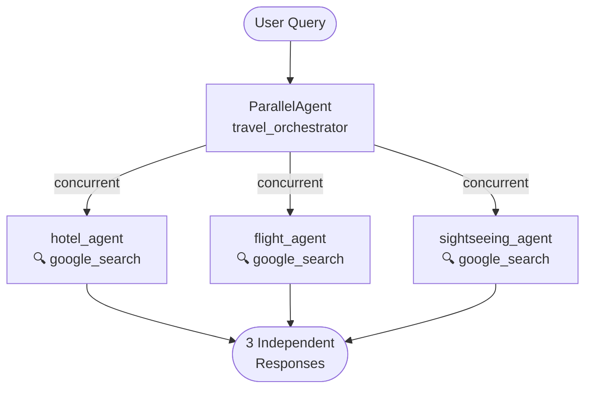
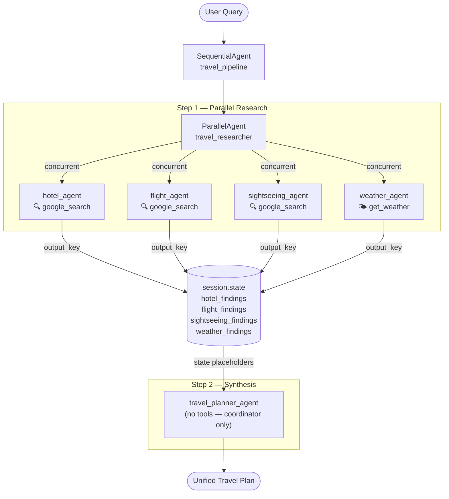
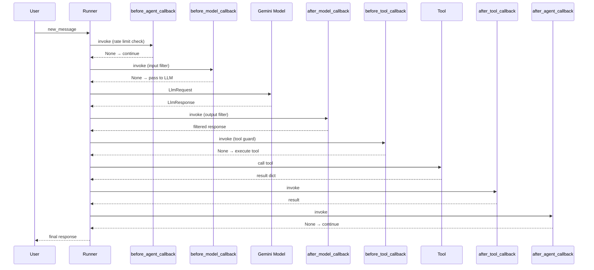

# Google ADK — From Zero to Production Patterns


A hands-on, heavily commented code series that walks through **Google Agent Development Kit (ADK)** from a bare-minimum agent all the way to production-grade multi-agent pipelines with callbacks, input filtering, and rate limiting.

Every file is self-contained and runnable. Comments explain the *why*, not just the *what*.

---

## Learning Path

```mermaid
graph LR
    A["01\nSimple Agent"] --> B["02\nSession Memory"]
    B --> C["03\nState Management"]
    C --> D["04\nBuilt-in Tools"]
    D --> E["05\nCustom Tools"]
    E --> F["06\nParallel Agents"]
    F --> G["07\nSequential + Parallel"]
    G --> H["08\nCallbacks & Governance"]

    style A fill:#4A90D9,color:#fff
    style B fill:#4A90D9,color:#fff
    style C fill:#4A90D9,color:#fff
    style D fill:#7B68EE,color:#fff
    style E fill:#7B68EE,color:#fff
    style F fill:#E67E22,color:#fff
    style G fill:#E67E22,color:#fff
    style H fill:#E74C3C,color:#fff
```



---

## Files at a Glance

| # | File | Core Concept | Key ADK APIs |
|---|------|-------------|--------------|
| 01 | `01-simple-agent.py` | Minimal agent + runner | `Agent`, `InMemoryRunner` |
| 02 | `02-session-memory-agent.py` | Multi-turn conversation memory | `InMemorySessionService`, `Runner` |
| 03 | `03-state-management-agent.py` | Structured key-value state | `session.state`, `get_session` |
| 04 | `04-tools-agent.py` | Built-in tools (search + code exec) | `google_search`, `BuiltInCodeExecutor` |
| 05 | `05-custom-tool-agent.py` | Custom Python function as tool | `FunctionTool` (auto-wrapped) |
| 06 | `06-parallel-agents.py` | Fan-out to specialised agents | `ParallelAgent` |
| 07 | `07-sequential-parallel-agents.py` | Research → Synthesis pipeline | `SequentialAgent`, `output_key` |
| 08 | `08-callbacks-filters-rate-limiter.py` | Governance layer | Callbacks, `RunConfig`, rate limiter |

---

## Architecture Diagrams

### 06 — Parallel Agents

Three specialised agents answer the same user query simultaneously. Responses arrive in non-deterministic order — whichever finishes first.



---

### 07 — Sequential → Parallel Pipeline

A `SequentialAgent` guarantees the research phase (parallel) completes before the synthesis phase begins. Each parallel agent writes its result to `session.state` via `output_key`; the planner reads those values through `{placeholder}` substitution in its instruction.



---

### 08 — Callback Lifecycle & Governance

Each callback in the chain can short-circuit execution. `before_model_callback` returning a non-`None` value skips the LLM entirely; `before_tool_callback` returning a non-`None` dict skips tool execution.



**Governance features in `08-callbacks-filters-rate-limiter.py`:**

| Feature | Mechanism | Where |
|---------|-----------|-------|
| Input keyword filter | `before_model_callback` scans full request history | Blocks if any turn contained banned words |
| Output content filter | `after_model_callback` redacts sensitive patterns | Regex replacement before response is returned |
| Rate limiter | `before_agent_callback` + `session.state` sliding window | Blocks after N calls per time window |
| Hard LLM cap | `RunConfig(max_llm_calls=N)` | Raises `LlmCallsLimitExceededError` |
| Audit log | JSON logger in every callback | Written to `audit.log` + stdout |

---

## Setup

### Prerequisites

- Python 3.12+
- A [Google AI Studio](https://aistudio.google.com/) API key (free tier works)

### Install

```bash
git clone <repo-url>
cd google-adk-series

python -m venv .venv
source .venv/bin/activate      # Windows: .venv\Scripts\activate

pip install -r requirements.txt
```

### Configure

```bash
cp .env.example .env
# then edit .env and add your key:
# GOOGLE_API_KEY=your_key_here
```

> **Note:** Files 04 and 06–07 use `google_search`, which requires the Gemini API key (already set above). File 05 uses [Open-Meteo](https://open-meteo.com/) — no key needed.

### Run any file

```bash
python 01-simple-agent.py
python 08-callbacks-filters-rate-limiter.py
```

---

## Key Concepts Cheat Sheet

### Callback Signatures

```python
# Agent lifecycle
before_agent_callback(*, callback_context: CallbackContext) -> Optional[Content]
after_agent_callback(*, callback_context: CallbackContext) -> Optional[Content]

# Model lifecycle
before_model_callback(callback_context, llm_request: LlmRequest) -> Optional[LlmResponse]
after_model_callback(callback_context, llm_response: LlmResponse) -> Optional[LlmResponse]

# Tool lifecycle
before_tool_callback(tool: BaseTool, args: dict, tool_context: ToolContext) -> Optional[dict]
after_tool_callback(tool: BaseTool, args: dict, tool_context: ToolContext, result: dict) -> Optional[dict]
```

### Short-circuit Rules

| Callback | Returns non-`None` | Effect |
|----------|-------------------|--------|
| `before_model_callback` | `LlmResponse` | Skips LLM call entirely |
| `after_model_callback` | `LlmResponse` | Replaces model's actual response |
| `before_agent_callback` | `Content` | Skips entire agent run |
| `before_tool_callback` | `dict` | Skips tool execution, returns dict as result |

### State vs Memory

| | `session.state` | Conversation history |
|-|-----------------|---------------------|
| What | Key-value dict | List of `Content` messages |
| Scope | Session lifetime | Session lifetime |
| Access | `callback_context.state`, `session.state` | Sent to LLM automatically by Runner |
| Use case | Structured data (preferences, flags) | Natural language context |

---

## Tech Stack

| Component | Library | Version |
|-----------|---------|---------|
| Agent framework | `google-adk` | 1.33.0 |
| Gemini SDK | `google-genai` | 1.75.0 |
| Model | Gemini 2.5 Flash | — |
| Weather API | Open-Meteo (free) | — |
| Env management | `python-dotenv` | 1.2.2 |

---

## License

MIT
